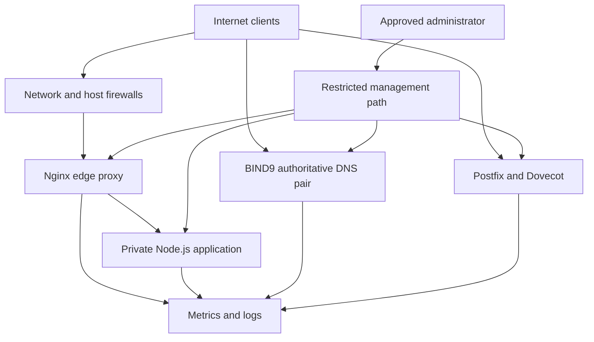

# InfraForge

> Secure Web, DNS & Mail Infrastructure Platform

InfraForge is a production-style Linux infrastructure portfolio project for a small company. It combines a secure web platform, authoritative DNS, authenticated mail, observability, recovery, Infrastructure as Code, configuration management, and controlled delivery automation.

## Problem statement

Many infrastructure demonstrations show isolated tools but omit the relationships that make a platform operable: network boundaries, DNS dependencies, secure administration, monitoring, restoration, and failure response. InfraForge addresses that gap with one coherent platform reproducible in a local lab and prepared for AWS.

## Objectives

- Administer and harden Ubuntu Server LTS.
- Segment management, edge, application, DNS, mail, operations, and backup traffic.
- Run BIND9 as authoritative-only DNS with primary and secondary servers.
- Terminate TLS and proxy application traffic through Nginx.
- Provide SMTP submission and IMAPS without becoming an open relay.
- Collect metrics and logs and generate actionable alerts.
- Prove backup restoration and document disaster recovery decisions.
- Provision AWS with Terraform and configure hosts with Ansible.
- Validate changes through GitHub Actions and automated tests.

## Project status

**Current milestone: Phase 2 — Repository Foundation**

This phase establishes documentation, contribution rules, environment examples, secret protections, and directory boundaries. Service configurations are intentionally not implemented yet.

| Area | Status | Phase |
|---|---|---:|
| Architecture | Designed | 1 |
| Repository foundation | Complete | 2 |
| Local Linux lab | Planned | 3 |
| Networking and firewall | Planned | 4 |
| Authoritative DNS | Planned | 5 |
| Web and application | Planned | 6 |
| Mail | Planned | 7 |
| Security hardening | Planned | 8 |
| Monitoring and alerting | Planned | 9 |
| Central logging | Planned | 10 |
| Backup and restore | Planned | 11 |
| AWS Terraform | Planned | 12 |
| Ansible automation | Planned | 13 |
| CI/CD | Planned | 14 |
| Automated testing | Planned | 15 |
| Security review | Planned | 16 |
| Final documentation | Planned | 17 |

## Architecture



See [Architecture](docs/architecture/overview.md) and [Network Design](docs/architecture/networking.md).

## Network design

The platform uses `10.10.0.0/16` with role-based subnets.

| Zone | CIDR | Purpose |
|---|---:|---|
| Management | `10.10.10.0/24` | Administration and Ansible |
| Edge | `10.10.20.0/24` | Nginx reverse proxy |
| Application | `10.10.30.0/24` | Private application services |
| Mail | `10.10.40.0/24` | Postfix and Dovecot |
| DNS | `10.10.50.0/24` | Authoritative name servers |
| Operations | `10.10.60.0/24` | Prometheus, Grafana, Loki and Alertmanager |
| Backup | `10.10.70.0/24` | Backups and restore staging |

Docker networks will use non-overlapping `172.28.0.0/16` ranges.

## Technology stack

| Concern | Technology | Purpose |
|---|---|---|
| OS | Ubuntu Server LTS | Stable Linux platform |
| Edge | Nginx | HTTPS, proxying and request controls |
| Application | Node.js and Express | Observable demo API |
| DNS | BIND9 | Authoritative DNS |
| Mail | Postfix, Dovecot, OpenDKIM | SMTP, submission, IMAPS and DKIM |
| Security | UFW/nftables, Fail2ban, OpenSSH | Access and abuse controls |
| Containers | Docker Compose | Reproducible services |
| Observability | Prometheus, Grafana, Loki | Metrics, dashboards and logs |
| Automation | Terraform and Ansible | Cloud resources and host configuration |
| Delivery | GitHub Actions | Validation and controlled deployment |

## Planned public interfaces

| Interface | Exposure |
|---|---|
| HTTP `80/tcp` | Public; redirect only |
| HTTPS `443/tcp` | Public edge only |
| DNS `53/tcp`, `53/udp` | Public authoritative servers only |
| SMTP `25/tcp` | Public mail host only |
| Submission `587/tcp` | Authenticated users |
| IMAPS `993/tcp` | Mail users |
| SSH `22/tcp` | Approved management sources only |
| Application and observability ports | Private only |

## Environments

### Local lab

Ubuntu VMs model system services. Docker runs the application and observability components where appropriate. Mail remains lab-restricted, and TLS begins with a private test certificate authority.

### AWS

Terraform will provision segmented networking, security groups, EC2, encrypted storage, IAM roles, and encrypted S3 backups. Public DNS uses two endpoints in separate failure domains. Public mail activation remains conditional on reverse DNS, provider restrictions, and safety tests.

## Security model

- Default-deny inbound access.
- SSH keys, no remote root login, and least-privilege `sudo`.
- Public DNS recursion disabled.
- SMTP relay limited to local destinations, authenticated users, and narrowly trusted networks.
- Internal application and observability endpoints remain private.
- No credentials, private keys, state files, or real environment files in Git.
- Configuration validation before reload or deployment.

Read [SECURITY.md](SECURITY.md) before using the project.

## Repository map

```text
app/          Demo application (Phase 6)
nginx/        Edge configuration (Phase 6)
dns/          BIND9 configuration (Phase 5)
mail/         Postfix and Dovecot (Phase 7)
monitoring/   Metrics, alerts and logs (Phases 9–10)
docker/       Container orchestration (from Phase 6)
ansible/      Configuration management (Phase 13)
terraform/    AWS infrastructure (Phase 12)
scripts/      Operational helpers (from Phase 3)
tests/        Validation (expanded through Phase 15)
docs/         Architecture, operations, security and runbooks
```

## Deployment and testing

No deployment command exists in Phase 2 because hosts, networks, and services have not been implemented. Cloud deployment waits until local behaviour is validated. Terraform destruction will never be automatic.

Future CI follows: lint → validate → test → scan → build → approve → deploy → smoke test.

## Documentation

- [Architecture overview](docs/architecture/overview.md)
- [Network design](docs/architecture/networking.md)
- [DNS design](docs/architecture/dns.md)
- [Mail design](docs/architecture/mail.md)
- [Security model](docs/security/security-model.md)
- [Secrets management](docs/security/secrets-management.md)
- [Deployment](docs/operations/deployment.md)
- [Backups](docs/operations/backups.md)
- [CI/CD](docs/operations/cicd.md)
- [Testing](docs/operations/testing.md)
- [Troubleshooting](docs/runbooks/troubleshooting.md)
- [Architecture decisions](docs/decisions/README.md)

## Lessons learned

Repository claims must match working capability. Planned services are marked as planned rather than presented as complete.

## Author

**Michael Olayenikan** — DevOps, Cloud, Backend, Platform Engineering and SRE portfolio project.

## License

[MIT](LICENSE). Production use requires an independent security and operational review.
